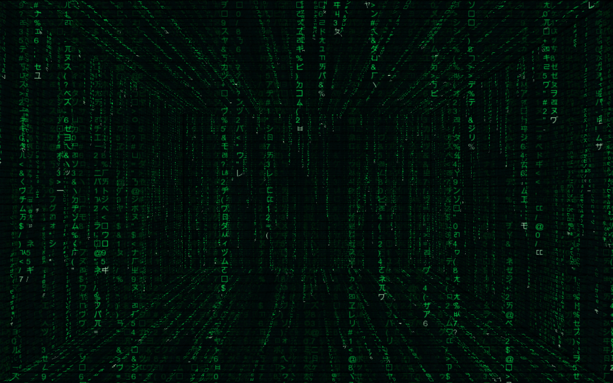
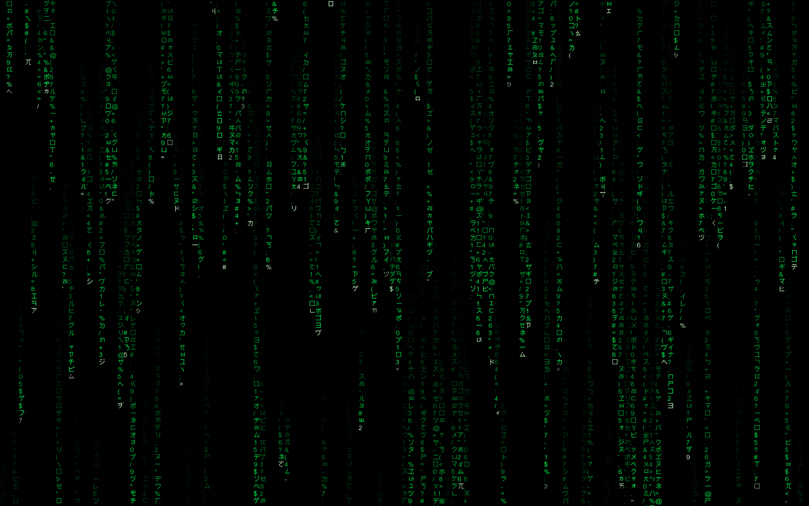

# matrixTextRain
openFrameworks project that implements the flowing digits effect on The Matrix movie. 

Click to the following image to watch video

Screeshots

Todo:
- [ ] Shader for glowing effect
- [ ] Audio responsive mode
- [ ] GLSL 3.0 support
- [ ] Code optimization